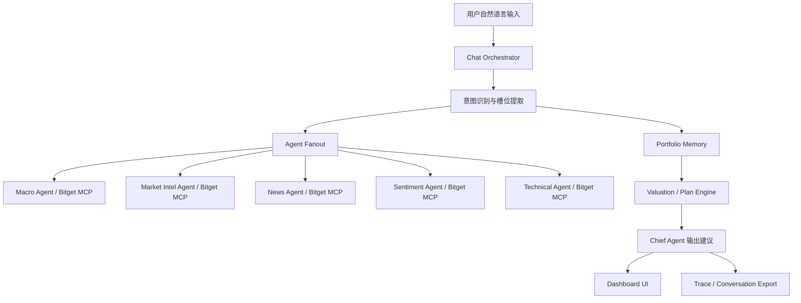

# Decision Brain

> Bitget 黑客松参赛项目：给交易 Agent 装上长期记忆、仓位上下文、估值纪律和可追溯复盘能力。

Decision Brain 不是自动交易机器人，也不是普通行情聊天机器人。它更像交易 Agent 和用户之间的长期决策记忆层：记录用户为什么买、买了多少、成本是多少、目标是什么、什么条件下才应该加仓或卖出。

## 为什么做这个项目

真实投资里，一个常见问题不是用户一开始完全没有判断，而是后面忘了自己一开始怎么判断。

用户买入一个代币时，通常会有当时的理由：

- 觉得资产明显回调，估值有吸引力。
- 想长期囤某个核心资产，比如 10 个 BTC。
- 认为某个叙事、上所路径、流动性改善或基本面变化会带来机会。
- 给自己设过底仓、止盈区、复盘条件。

但市场回撤以后，用户很容易被短期情绪带走：

```text
我当时想长期囤 BTC。
现在跌得好厉害，我怕继续跌到 3 万。
我要不要先卖掉一半？
```

普通行情 AI 往往只会继续分析当前价格、新闻和技术指标，然后给一个当下建议。它不知道用户当初为什么买，不知道用户的目标仓位，也不知道这次卖出是理性复盘，还是恐慌下偏离原计划。

Decision Brain 要解决的就是这个问题：当用户想加仓或卖出时，Agent 先回看用户自己的仓位、成本、原始 thesis、目标仓位、估值计划和底仓规则，再结合市场数据做判断。

一句话概括：

> 市场波动时，Decision Brain 先让 Agent 记起用户自己的投资原则，而不是只跟着当下情绪走。

## 它解决的痛点

| 痛点 | 普通行情 AI 的问题 | Decision Brain 的处理方式 |
|---|---|---|
| Agent 没有长期记忆 | 每轮对话从零开始 | Portfolio Memory 持久化仓位、成本、目标、thesis 和计划 |
| 用户忘记买入初衷 | 下跌后只盯当前价格 | Thesis Guard 回看原始投资逻辑和目标进度 |
| 买卖建议太草率 | 市场信息直接变成操作建议 | Valuation / Plan Engine 提供估值区间、底仓和复盘条件 |
| 卖出语义混乱 | “想卖”“已卖”容易混在一起 | 三层状态机区分复盘、待确认记录、确认执行记录 |
| 建议不可追溯 | 不知道每个结论来自哪里 | Agent trace、source ledger、对话导出可复盘 |
| Demo 不稳定 | 现场聊天容易跑偏 | Harness 固定剧本自动验证核心场景 |

## 核心 Demo 场景

Demo 最重要的一幕是“恐慌卖出护栏”：

1. 用户记录目标：长期囤 BTC。
2. 用户记录仓位：持有 1 个或 3 个 BTC，成本价明确。
3. 用户记录买入理由：比如“BTC 回调比较多，所以想长期囤”。
4. 市场下跌后，用户说：“我想卖掉一半，我怕跌到 3 万。”
5. Decision Brain 不会直接改仓位，也不会直接建议清仓。
6. 系统先回看原始目标、当前持仓进度、成本价、买入理由、底仓规则和 thesis 是否失效。
7. 如果用户只是说“卖 30%”“可以卖吗”“先卖 15%”，系统只做复盘，不更新仓位。
8. 只有用户明确说“我已经卖了 0.15 BTC，帮我记录”，并二次回复“确认记录卖出”，系统才更新持仓。

这让 Demo 能清楚展示项目价值：它不是替用户冲动交易，而是帮助用户在波动中保持投资纪律。

## Bitget MCP Skills 怎么发挥作用

Bitget MCP Skills 在项目里是市场感知层。它们负责提供外部市场信号，但不直接下交易指令。

| Bitget MCP Skill | 对应 Agent | 作用 |
|---|---|---|
| `macro-analyst` | Macro Agent | 宏观环境、利率、风险偏好 |
| `market-intel` | Market Intel Agent | 市场情报、链上数据、流动性 |
| `news-briefing` | News Agent | 新闻事件、社交媒体趋势 |
| `sentiment-analyst` | Sentiment Agent | 恐惧贪婪、衍生品情绪 |
| `technical-analysis` | Technical Agent | 技术结构、支撑压力、价格形态 |

这些 Skill 的结果会进入 Agent War Room，评委可以看到哪些 Agent 被调用、调用原因和 trace。Chief Agent 最终会把 Bitget MCP 的市场信号与用户自己的长期记忆合并：

```text
Bitget MCP 提供市场现在发生了什么。
Decision Brain 记住用户当初为什么买。
Chief Agent 判断这次操作是理性复盘，还是情绪化偏离。
```

项目明确不使用 Bitget 交易 API，不保存私钥，不自动下单。

## 技术栈

### 后端

- **Node.js ESM**
  - 作为主服务运行环境。
  - 负责 HTTP API、MCP server、Agent 编排、测试脚本和 Demo harness。

- **原生 Node HTTP 服务**
  - 提供 Dashboard 页面和 JSON API。
  - 暴露仓位管理、计划确认、资产上下文、加仓审查、卖出审查、每日监测等接口。

- **MCP JSON-RPC stdio server**
  - 让外部 Agent 可以通过 MCP 工具协议调用 Decision Brain。
  - 暴露 `manage_position`、`get_asset_context`、`review_add_intent`、`review_sell_intent`、`run_daily_monitor` 等工具。

- **本地 JSON 状态存储，可扩展到 KV**
  - 默认用本地状态文件保存资产、仓位、计划、估值模型和 trace。
  - 代码中预留 Vercel KV 适配空间。

### 前端

- **原生 HTML / CSS / JavaScript**
  - 黑客松 Demo 优先，减少框架复杂度。
  - 三栏布局：Chief 对话、资产主看板、Agent 作战室。

- **Canvas / Chart**
  - 展示资产趋势和组合状态。

- **Three.js**
  - 首页动态大脑视觉，突出“Decision Brain”概念。

### Agent 与 AI 层

- **Chat Orchestrator**
  - 理解开放式自然语言。
  - 区分研究、记录仓位、加仓、卖出、恐慌卖出、已卖出记录、确认记录等意图。

- **Agent Fanout**
  - 根据意图调度 Memory、Macro、Market Intel、News、Sentiment、Technical、Valuation 等 Agent。

- **Rule fallback + LLM path**
  - 测试和离线演示可走规则路径，保证稳定。
  - 真实 Demo 可以接 OpenAI-compatible API / DeepSeek。

## 记忆系统怎么处理

Decision Brain 的关键不是“多聊几句”，而是把投资上下文结构化保存。

状态按资产统一归档：

- `assets`：资产身份、symbol、chain、别名。
- `positions`：持仓数量、平均成本、当前价格、总成本、当前价值。
- `plans`：draft / active 计划、目标仓位、底仓规则、卖出条件。
- `valuationModels`：估值区间和场景。
- `researchReports`：项目调研摘要、风险、催化剂、基础指标。
- `sources`：外部来源和人工补充资料。
- `events`：重要事件。
- `traces`：每次 Agent 调用和决策链。
- `monitorState`：每日监测状态，默认 24 小时节奏。

这样做有三个好处：

1. **不会把资产写错**：每个资产按 `assetId` 管理，避免用户说 BTW 结果写成 XMR。
2. **不会忘记投资初心**：原始 thesis、目标仓位、底仓规则会进入计划和资产上下文。
3. **不会把复盘当执行**：卖出意图必须通过状态机，只有确认记录后才更新仓位。

卖出状态机：

```text
review_sell
  用户只是想卖、怕跌想卖、问能不能卖、说卖 30%
  只做复盘，不修改仓位

sell_execute
  用户明确说已经卖出
  只生成待确认卖出草稿

sell_execute_confirmed
  用户回复“确认记录卖出”
  才更新仓位数量
```

## 架构



Dashboard 三栏：

- 左侧：Chief 对话，处理开放式表达。
- 中间：资产主看板，展示组合估值、资产数量、成本、当前价值、盈亏。
- 右侧：Agent 作战室，展示 Agent 状态、Bitget MCP Skills、调度日志和 trace。

## Harness 是什么

Harness 是固定剧本测试器，用来证明 Demo 核心能力不是偶然聊出来的。

它会自动跑类似这样的路径：

```text
记录 BTC 目标和仓位
记录买入理由
模拟市场下跌
用户表达恐慌卖出
系统必须回看目标、进度、thesis、计划边界
用户说“卖 30%”时不得清空仓位
用户确认记录卖出后才更新资产
```

关键命令：

```bash
cd 源代码
npm run demo:thesis-guard
npm run test:plan18
```

## 本地运行

```bash
cd 源代码
npm install
npm start
```

打开：

```text
http://127.0.0.1:4177/
```

常用测试：

```bash
npm test
npm run test:plan16:all
npm run test:plan18
```

当前测试状态：

- `npm test`：54/54 通过
- `npm run test:plan16:all`：114/114 通过
- `npm run test:plan18`：28/28 通过

## MCP / Agent 接入

HTTP API 和 MCP tools 都围绕同一套记忆状态工作。

常用接口：

- `POST /api/manage-position`
- `POST /api/confirm-plan`
- `GET /api/asset-context?asset=BTC`
- `POST /api/review-add-intent`
- `POST /api/review-sell-intent`
- `POST /api/run-daily-monitor`
- `GET /api/portfolio-summary`
- `GET /api/state`

MCP 工具：

- `capabilities`
- `manage_position`
- `confirm_plan`
- `get_asset_context`
- `review_add_intent`
- `review_sell_intent`
- `run_daily_monitor`
- `log_source`
- `archive_asset`

## 项目边界

Decision Brain 明确不做：

- 不自动交易。
- 不保存私钥。
- 不托管资金。
- 不做高频交易。
- 不承诺收益。

它做的是研究、记忆、计划、复盘和可解释建议。

## 目录结构

| 路径 | 说明 |
|---|---|
| `源代码/` | 主应用：HTTP 服务、MCP 服务、Dashboard、测试 |
| `plan/` | 开发计划、验收报告、Demo 脚本和复盘材料 |
| `assets/` | Logo 和视觉素材 |
| `OpenClaw交付包/` | 外部 Agent 平台对接包 |
| `Lobster状态/` | Demo placeholder 状态 |

## 安全说明

- `.env`、API key、钱包私钥、助记词、运行时真实状态不进入仓库。
- 配置通过环境变量或占位符注入。
- 对话导出只提交 demo session，不提交真实账户信息。
- 项目不请求交易权限，不保存交易所密钥。
