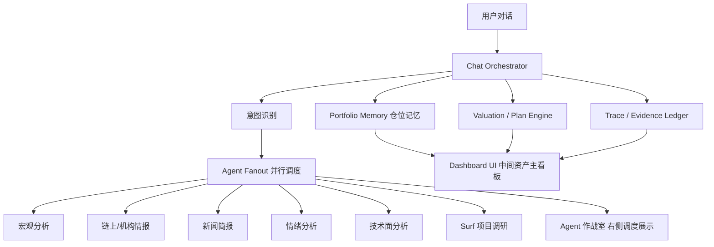

# Decision Brain

Decision Brain 不是一个行情聊天机器人，而是交易 Agent 和用户之间的**长期决策记忆层**。

## 为什么做 Decision Brain

交易 Agent 需要长期记忆和纪律约束。普通 AI 很容易在用户情绪变化时跟着当下语境跑：用户上涨时想追高，它就分析上涨；用户下跌时想卖出，它就分析下跌。这样无法解决真实投资里最常见的问题：**用户忘记自己当初为什么买、目标是什么、什么条件下才应该卖**。

Decision Brain 解决的核心问题：
- 记住仓位、成本、目标、投资 thesis
- 在加仓/卖出前回看估值、事件、thesis、底仓规则
- 让 Bitget MCP Skill 的市场感知变成可解释的投资委员会流程

## 为什么不是自动交易机器人

- 不保存私钥
- 不自动下单
- 只做研究、记忆、计划、复盘和建议

## 解决的核心痛点

普通行情 AI 最大的问题是**没有用户自己的上下文**：

1. **Agent 没有长期记忆** — 每次对话从零开始，记不住仓位、成本、目标
2. **用户忘记当初为什么买** — 买入时有估值判断和投资逻辑，但市场回撤后容易被短期情绪覆盖
3. **缺少估值纪律** — 市场信息直接变成买卖建议，没有计划层和估值锚
4. **建议不可追溯** — 说不清依据，没法复盘，无法验证是对是错

Decision Brain 的核心价值：**市场波动时，先拉回用户自己的目标和 thesis，而不是跟着当下情绪走。**

## Bitget MCP Skills 如何发挥作用

Bitget MCP Skills 是 Decision Brain 的**市场感知层**，不是装饰。5 个 Skill 分别映射到不同 Agent：

| Bitget MCP Skill | Agent | 感知方向 | 在 Demo 中的作用 |
|---|---|---|---|
| `macro-analyst` | Macro Agent | 宏观环境、利率、风险偏好 | 判断是否处于 risk-on/risk-off 周期 |
| `market-intel` | Market Intel Agent | 链上数据、市场情报、流动性 | 补充机构和大户行为信号 |
| `news-briefing` | News Agent | 新闻事件、社交媒体趋势 | 识别短期叙事和事件驱动因素 |
| `sentiment-analyst` | Sentiment Agent | 恐惧贪婪指数、衍生品情绪 | 量化市场情绪，判断是否极端 |
| `technical-analysis` | Technical Agent | 价格结构、技术指标 | 提供价格形态和关键位参考 |

这些 Agent **不直接给交易指令**。市场感知结果统一交给 Chief Agent，Chief 再结合用户的仓位、成本、目标仓位、估值区间和原始 thesis，判断这次操作是理性复盘还是情绪化偏离。

关键区分：
- Bitget MCP Skills **只提供市场感知**（数据、趋势、情绪），不使用 Bitget 交易 API
- Decision Brain **只做决策层**（记忆、计划、建议），不执行交易

## 目前的核心能力

1. **仓位记忆与目标追踪**：记录每个资产的目标仓位（如"囤 10 个 BTC"）、投资初心（original thesis）、底仓规则，并实时追踪进度（如"3 / 10"）。
2. 记录仓位、成本、历史最高持仓，自动计算加权平均成本。
3. 自动生成项目调研摘要和对标估值模型。
4. 生成 `draft` 投资计划，确认后切换成 `active` 持续监控。
5. **恐慌卖出护栏（Panic Sell Guardrail）**：用户恐慌卖出时，系统先回看投资初心（原目标、当前进度、投资 thesis、计划边界和底仓规则），区分情绪化卖出和理性卖出，给出 3 个克制选项。卖出意图分流为三层状态机：`review_sell`（只想卖/怕跌想卖 → 纯复盘）→ `sell_execute`（已卖出 → 待确认草稿）→ `sell_execute_confirmed`（确认记录卖出 → 才更新仓位）。
6. **Harness 回归验证**：固定演示脚本重放用户真实行为（恐慌 → 卖30% → 可以卖吗 → 先卖15% → 刷新研究 → 持仓总览 → 确认卖出），通过自动化测试验证系统不会把"想卖"误判为"已卖"，不会在复盘阶段清空仓位。
7. **Bitget MCP 市场感知层**：5 个 Agent（宏观/市场情报/新闻/情绪/技术分析）通过 Bitget MCP Skills 提供市场数据，统一交给 Chief Agent 结合用户的仓位、成本、目标和 thesis 做决策，不直接给交易指令。
7. 对话智能去重：同一资产连续追问不重复输出完整研报，模糊表达多样化路由。
8. 每 24 小时最多做一次新闻监测和仓位监测。
9. 保存干净的资产记忆和 Decision Trace。
10. 暴露本地 HTTP JSON 接口和 MCP 接口，方便其他 Agent 调用。

## 这个 MVP 明确不做什么

- 不自动交易
- 不保存私钥
- 不做高频盯盘
- 不做托管

## 本地运行

```bash
cd decision-brain
npm start
```

启动后可访问：

- `http://127.0.0.1:4177/` for the dashboard
- `http://127.0.0.1:4177/api/health` for health
- `http://127.0.0.1:4177/api/capabilities` for tool contracts

如果你希望把状态文件放到别的位置，便于本地多实例或龙虾隔离调用，可以在启动前设置：

```bash
export DECISION_BRAIN_DATA_DIR=/absolute/path/to/decision-brain-data
npm start
```

或者直接指定完整文件路径：

```bash
export DECISION_BRAIN_STATE_FILE=/absolute/path/to/state.json
npm start
```

如果你就是想直接按“给龙虾长期用”的模式启动，不想自己设变量：

```bash
cd decision-brain
npm run start:lobster
```

它会默认使用 `~/.decision-brain-lobster` 作为数据目录。

## MCP 运行

如果龙虾更适合走工具协议而不是直接打 HTTP，可以直接启动本地 MCP 入口：

```bash
cd decision-brain
npm run mcp
```

如果你要直接给龙虾挂 MCP，也可以用：

```bash
cd decision-brain
npm run mcp:lobster
```

它同样会默认使用 `~/.decision-brain-lobster` 作为数据目录。

这个 MCP 入口暴露的工具包括：

- `capabilities`
- `manage_position`
- `confirm_plan`
- `get_asset_context`
- `review_add_intent`
- `review_sell_intent`
- `run_daily_monitor`
- `log_source`
- `archive_asset`

## 每日监测脚本

如果你想让系统每天自己跑一次监测，可以用：

```bash
cd decision-brain
npm run monitor:daily
```

说明：

- 默认会遵守 24 小时节奏
- 如果当天已经跑过，会自动跳过
- 如需强制执行，可直接运行 `node src/scripts/run-daily-monitor.mjs --force`

## 重置状态

如果你想在 demo 前或接入龙虾前清空本地记忆，可以执行：

```bash
cd decision-brain
npm run reset:state
```

这会重建一个干净的标准化状态文件，但不会删除代码和文档。

## 快速演示

如果你想不启 HTTP 服务，直接在本地跑一遍完整核心流程，可以执行：

```bash
cd decision-brain
npm run demo:flow
```

它会自动：
1. 重置状态
2. 纳入一个示例资产
3. 生成 draft 计划
4. 确认计划
5. 模拟恐慌卖出情绪 → 触发 Panic Sell Guard 护栏
6. 执行卖出审查 → 回看 thesis + 计划边界 + 底仓规则
7. 运行一次每日监测
8. 输出卖出建议和最终上下文摘要

### 投资初心护栏 Demo

Plan XVI 新增的 Thesis Guard 演示：

```bash
cd decision-brain
npm run demo:thesis-guard
```

固定剧本：
1. 重置 Demo 状态
2. 写入用户目标：长期囤 10 BTC
3. 写入当前仓位：已有 3 BTC，平均成本 $60,000
4. 写入投资逻辑：长期配置 BTC，不做短线
5. 模拟市场下跌
6. 用户说：跌得好厉害，我想卖掉 BTC
7. 系统触发恐慌卖出护栏
8. 导出完整对话和 trace 到 `demos/thesis-guard-demo.md`

Demo 展示亮点：投资初心护栏、目标进度显示、thesis 失效判断、克制选项

## 龙虾 / Agent 接入

这个 MVP 直接暴露本地 HTTP JSON 接口，龙虾可以把它当作一个“投资顾问后端”来调用。

核心接口：

- `GET /api/capabilities`
- `POST /api/manage-position`
- `POST /api/confirm-plan`
- `POST /api/review-add-intent`
- `POST /api/review-sell-intent`
- `POST /api/run-daily-monitor`
- `GET /api/asset-context?asset=SYMBOL`
- `POST /api/archive-asset`
- `GET /api/state`

推荐调用顺序：

1. `manage-position`
   作用：建仓/关注某资产，写入仓位、生成研究、生成估值、生成 draft 计划。
2. `confirm-plan`
   作用：确认计划并切到 `active`，开始后续监测。
3. `asset-context`
   作用：龙虾每次回答用户前，先拉这个资产的完整记忆上下文。
4. `review-add-intent` / `review-sell-intent`
   作用：用户说“我想加仓/我想卖出”时调用。
5. `log-source`
   作用：把龙虾在研究过程中看到的文章、推文、判断来源追加到资产记忆里。
6. `run-daily-monitor`
   作用：每日调用一次即可，系统会自动限制为 24 小时节奏。
7. `archive-asset`
   作用：资产不再跟踪时归档，避免记忆混乱。

### 给龙虾的最小执行准则

如果你要把它接成“投资顾问脑子”，龙虾这边最好遵守这 6 条：

1. 用户第一次提到某资产时，先调 `manage-position`。
2. 用户每次问“现在怎么看 X”之前，先调 `get-asset-context`。
3. 用户问“能不能加仓”时，调 `review-add-intent`，不要只看价格。
4. 用户问“要不要卖”时，调 `review-sell-intent`，不要自己跳过计划层。
5. 每天最多调用一次 `run-daily-monitor`。
6. 外部调研结论不要只存在龙虾上下文里，要通过 `log-source` 写回 source ledger。
7. 价格曲线只能作为辅助输入，不能跳过估值、事件和 thesis。

如果你要直接照着示例跑 HTTP，可以看：

- [examples/http-demo.sh](examples/http-demo.sh)
- [examples/lobster-mcp.config.example.json](examples/lobster-mcp.config.example.json)

如果你想直接生成当前机器可用的龙虾 MCP 配置，可以执行：

```bash
cd decision-brain
npm run bootstrap:lobster
```

它会输出带当前绝对路径的 JSON，可直接复制进你的龙虾 MCP 配置。
输出里会优先使用当前 Node 运行时的绝对路径，减少不同客户端里的 PATH 差异。

如果你已经知道龙虾的 MCP 配置文件路径，也可以直接安装进去：

```bash
cd decision-brain
npm run install:lobster -- /absolute/path/to/mcp_config.json
```

它会保留原有配置，并自动合并 `decision-brain` 这一项。
如果目标配置文件采用的是 `servers` 结构，脚本也会自动兼容。

如果你懒得挑路径，也可以直接自动安装到推荐目标：

```bash
cd decision-brain
npm run install:lobster:auto
```

如果你要在另一个 home 目录或沙盒环境里调试配置发现/安装，可以额外设置：

```bash
export DECISION_BRAIN_HOME_DIR=/custom/home
```

安装后如果你想确认哪些 MCP 配置里已经挂上了 `decision-brain`，可以执行：

```bash
cd decision-brain
npm run verify:lobster
```

如果你不确定这台机器上有哪些常见 MCP 配置文件，可以先执行：

```bash
cd decision-brain
npm run discover:lobster
```

它会列出本机上已找到的常见候选路径。

示例：

```bash
curl -s http://127.0.0.1:4177/api/manage-position \
  -H 'content-type: application/json' \
  -d '{
    "assetQuery": "SOL",
    "units": 100,
    "averageCost": 120,
    "currentPrice": 175,
    "portfolioValue": 50000,
    "naturalLanguagePlan": "2x 回本金，3x 卖 30%，5x 再卖 30%，保留历史最高持仓 20% 底仓"
  }'
```

## 记忆系统

所有状态都保存在 `data/state.json`，并且按固定分区管理：

- `assets`
- `positions`
- `researchReports`
- `sources`
- `valuationModels`
- `plans`
- `events`
- `traces`
- `monitorState`

这样做的目的就是避免记忆混乱。每个资产的仓位、研究、估值、计划、事件、Trace 都按 `assetId` 归一管理。龙虾最稳的读取方式是直接调 `GET /api/asset-context?asset=SYMBOL`，不要自己拼接多个来源。

其中最关键的约束有两个：

1. 所有长期记忆都要回写到 Decision Brain，不让龙虾自己维护一份影子记忆。
2. 所有 active 资产的新闻和仓位监测都走 `monitorState`，默认 24 小时一次。

`researchReports` 里会额外保留这些结构化信息，方便龙虾做更像投顾的解释：

- `listedExchanges`
- `potentialExchanges`
- `exchangePathHypothesis`
- `liquidityNote`
- `factualSignals`
- `inferredSignals`

`review-add-intent` 和 `review-sell-intent` 的返回，会统一带上：

- `finalRecommendation`
- `suggestedAction`
- `coreReasons`
- `keyRisks`
- `whatChangesAdvice`
- `nextReminder`
- `priceCurveState`
- `structuredAdvice`

## 适配器现状

代码结构已经预留：

- Bitget adapters
- Surf research adapters

当前 Bitget adapter 已经支持 `refresh_research` 入口：

- 如果设置了 `BITGET_MCP_COMMAND`，会通过 MCP 调用 Bitget Skill
- 如果未设置，会明确返回 `bitget_skill_not_configured`，不会假装已经拿到真实 Bitget 数据

示例：

```bash
export BITGET_MCP_COMMAND="npx bitget-mcp-server"
```

Surf research adapter 目前仍是 mock fallback，后续需要接真实调研流程。

## 架构

```
┌────────────────────────────────────────────────────────────────────┐
│ Topbar: Decision Brain / LIVE / Reset                              │
├──────────────┬─────────────────────────────────────┬───────────────┤
│ 左侧 Chief    │ 中间 资产实时主看板 + K线趋势         │ 右侧 Agent 作战室 │
│ 对话输入输出   │                                     │               │
│              │ 1. 组合总估值 / 持仓数 / 纳入资产       │ 1. Agent 状态灯  │
│              │ 2. 资产列表 / 数量 / 成本 / 当前价值     │ 2. 调度制度      │
│              │ 3. 资产详情 / 删除或归档入口            │ 3. Bitget Skills │
│              │ 4. Bitget 发光趋势线                   │ 4. 调度日志      │
│              │                                     │ 5. 动态 Trace   │
└──────────────┴─────────────────────────────────────┴───────────────┘
```

数据流：



Dashboard 三列布局：
- **左侧：Chief 对话** — 开放式自然语言输入，意图识别后调度 Agent
- **中间：资产实时主看板** — 组合估值、资产列表、数量、成本、当前价值、K 线趋势图；对话写入后实时刷新
- **右侧：Agent 作战室** — Agent 状态灯（亮起/待命）、调度制度、Bitget MCP Skills 映射、Chief 调度日志、动态 Trace

不自动交易，只做可解释决策和资产记忆。

## Demo 视频

[](https://github.com/Levelup-JC/decision-brain/releases/download/demo-v1/decision-brain-demo.mp4)

视频内容：
- 开放式对话 → 意图识别 → Agent 调度
- Bitget MCP 5 个 Skill 调用链路展示
- 资产面板实时更新
- 发光趋势曲线
- Trace 可追溯证据

## 安全说明

- `.env` 文件通过 `.gitignore` 排除，不进入仓库
- API key 使用环境变量注入，不硬编码
- 钱包私钥、助记词绝不保存或提交
- 运行时状态文件（`data/state.json`）不提交
- 配置中使用占位符，不使用个人机器绝对路径
- 不自动交易、不托管资金、不承诺收益

## 当前 GitHub-ready 状态

当前仓库已经具备：

- 可直接运行的本地 HTTP 服务
- 可直接运行的本地 MCP 服务
- 龙虾专用一键启动脚本
- Lobster MCP 配置样例
- HTTP 调用示例脚本
- GitHub Actions 测试工作流
- 标准化状态存储
- 每日一次监测约束
- 龙虾调用说明
- 基础自动化测试
- Plan XII-XV 验收脚本
- Plan XVI 投资初心护栏 Harness 和测试套件（`npm run demo:thesis-guard`, `npm run test:plan16`, `npm run test:plan16:all`）
- 仓位记忆与目标追踪（investmentGoal, targetUnits, goalProgress）
- 投资初心护栏（Thesis Guard）：5-part 恐慌卖出回复结构，含目标进度、原始 thesis、计划边界
- 卖出意图四层区分（想卖/因跌想卖/准备卖/已经卖），sell_execute 确认记录流程
- 加权平均成本自动计算
- 对话导出 Markdown 复盘（含完整 trace 和 Agent 调用链）
- 测试套件：238 测试用例全部通过（54 core + 7 plan12 + 35 plan14 + 64 plan15 + 50 plan16 + 28 plan18）
- Plan XVIII 恐慌卖出护栏：卖出意图三层状态机（review_sell / sell_execute / sell_execute_confirmed），Harness 回归验证确保"想卖"不被误判为"已卖"

当前仍然是 MVP 的地方：

- 本机尚未配置真实 Bitget MCP Server 时，Bitget Skill 只会返回未连接状态
- Surf 适配器还是 mock
- 估值逻辑仍偏启发式
- 事件跟踪还没有接真实外部数据源
